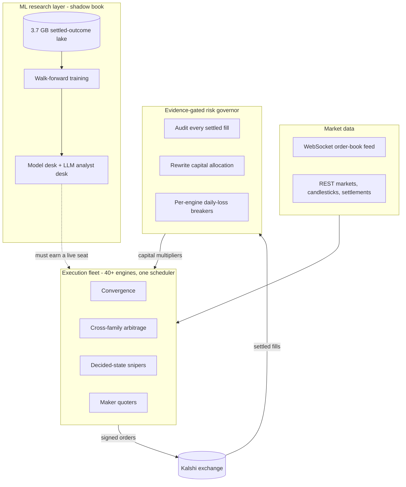
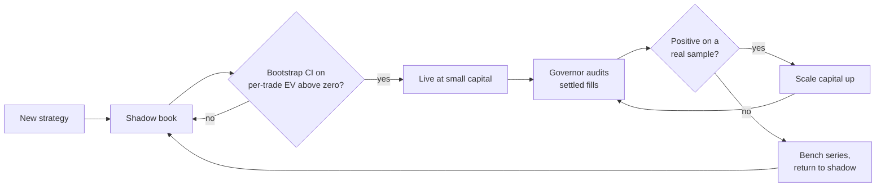
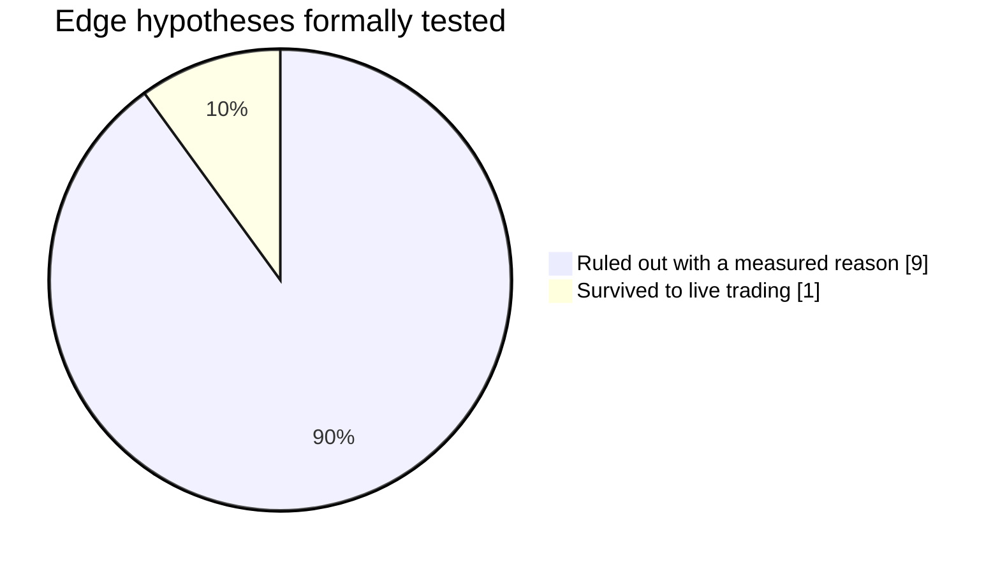

# Kalshi Quant Research

Systematic, evidence-gated trading research for **Kalshi**, the CFTC-regulated
event-contract exchange. Built and operated the way a small trading firm is
structured: a fleet of execution engines up front, a risk layer that governs
their capital from settled results, and a machine-learning research desk that has
to earn its way onto the book.

The single rule everything else serves: **no strategy touches real money until a
bootstrap confidence interval on its per-trade expected value clears zero on real,
settled outcomes.** Not a backtest. Settled fills.

> This repository is a public engineering and research record. The live-edge
> strategy code and the production engine fleet are private and are not published
> here.

---

## System at a glance

Three layers that mirror a real desk: engines execute, a governor allocates their
capital from realized results, and a research layer runs a shadow book beside
them without touching live orders.

## By the numbers

| Metric | Value |
|---|---|
| Execution engines | 40+ async engines under one scheduler |
| Settled-outcome data lake | 3.7 GB, 5.5M+ markets, refreshed daily |
| Settlement-scored shadow trades | 591 |
| Scored LLM forecasts | 1,447 |
| Versioned model generations | 14, with per-category Brier scores |
| Codebase | roughly 58k lines of Python, 1,400+ tests |

## How capital is governed

The core of the system is not a strategy. It is the governor that decides which
strategies get money. Every few hours it re-audits realized results per engine
and per market series (joined fills-true against settlement), then benches losers,
steps winners up, and keeps every allocation under a hard ceiling. Capital
follows demonstrated, settled expected value, and every decision is logged with
its reasoning.

Defense in depth sits underneath: per-engine daily-loss circuit breakers, a
stop-loss and exit monitor, portfolio-concentration guards, and durable kill
switches (including an email-driven remote halt) that all fail closed. A tripped
breaker cannot be cleared by a restart.

## The machine-learning research layer

Structured the way a research desk sits beside a trading desk, and walled off
from live order placement by design. It runs its own book and has to pass the
same statistical gates the live engines passed.

| Component | Role |
|---|---|
| **Data lake and training** | A 3.7 GB settled-outcome lake (5.5M+ markets, daily targeted backfill). Walk-forward training is gated on beating the market's own out-of-sample Brier score. A model that cannot out-predict the closing price does not ship. |
| **Pricing service** | Re-prices the tradeable venue against the current model every 15 minutes and logs net-of-fee edges. |
| **Model and analyst desks** | A shadow book. An ML model desk and an LLM analyst desk (Gemini to DeepSeek to OpenRouter failover, signal-only) log predictions that are then settlement-scored against real outcomes: 591 scored shadow trades and 1,447 scored forecasts to date. |

At current sample sizes the ML brain has not earned a live seat, and the system
says so on its own scoreboard rather than assuming otherwise.

## Research record: what was tested, what survived

The value of this project is the honest record. Most hypotheses were ruled out,
each for a measured reason, and one survived to live trading.

| Hypothesis | Verdict | Reason |
|---|---|---|
| Late-life event convergence | **Live** | Validated on hundreds of settled markets using full intra-market price paths, with fills confirmed against live order books. Thin margins, gated to the market families where it holds up. |
| LLM directional prediction | Ruled out | The market already reflects the same public information, so the signal is noise. A no-skill Monte Carlo shows the edge needed just to clear fees is unrealistic. |
| Complete-set arbitrage | Ruled out | Mutually exclusive does not mean exhaustive. The sub-dollar gap is priced tail risk from an unlisted outcome, not free money. |
| Favorite-longshot fade | Ruled out | Cheap longshots are genuinely overpriced, but the other side's ask sits above fair value and the spread eats the edge. |
| Plain market-making | Ruled out | Wide gross spreads, but adverse selection drags spread capture to roughly break-even on its own. |
| Weather-settlement latency | Ruled out | A real, verified pricing edge, but unreachable: free data feeds arrive after the book reprices, and the profitable price rungs hold only 1 to 2 contracts. |
| Crypto settlement oracle | Ruled out | A warm multi-venue feed genuinely ahead of the settlement print, yet the determined side already asks $1.00. The book is efficient exactly where it is liquid. |
| Passive maker tape-replay | Ruled out (method) | Tape-replay backtests systematically over-credit passive fills because they cannot model adverse selection. Only live fills or taker-on-tape evidence are trusted for maker ideas. |

The through-line: an edge is real only when it survives fees, depth, adverse
selection, and a confidence interval, not when it looks good on a chart.

## Engineering

- Roughly **58k lines of Python** with **1,400+ tests**.
- Async scheduler with subprocess isolation, single-instance locking, and
  automatic restart and recovery of both the fleet and its data-feed daemons.
- Cryptographically signed (RSA-PSS) order placement against the live API, with
  kill switches enforced at the universal order chokepoint so no launch path can
  bypass them.
- A resumable data pipeline that maintains a multi-gigabyte settled-outcome lake.

## Results and honest limitations

This is presented as an engineering and research showcase, and that is what it is.
Operated at small personal capital, net realized trading P&L is roughly
break-even by design. The objective was the risk architecture, the evidence
discipline, and the research machinery, not returns on a few hundred dollars. The
binding constraint on this venue is opportunity and order-book depth, not capital
or code, and the same architecture is what would let a proven edge scale if and
when capital and opportunity allow. Nothing here claims a profit it did not make.

## Disclaimer

Trading carries real risk of loss. Nothing here is financial advice, and there is
no guarantee of profit. Backtested and historical results are not a promise of
future performance.
